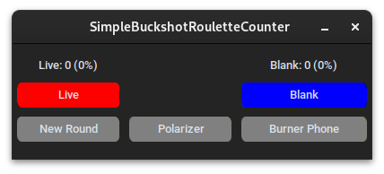

<h1 align="center">
   
  <b>SimpleBuckshotRouletteCounter</b>
   
</h1>

<h4 align="center">A bullet counter for the video game <a href="https://store.steampowered.com/app/2835570/Buckshot_Roulette/" target="_blank"><i>Buckshot Roulette</i></a></h4>

  <a href="#info">Info</a> •
  <a href="#download">Download</a> •
  <a href="#contributing">Contributing</a>

  

## Info

SimpleBuckshotRouletteCounter is a bullet counter for the video game Buckshot Roulette by Mike Klubnika. It features several features such as autofill, burner phone and polarizer support, and a sleek overlay GUI.

## Download

To use this tool, you generally have two options

### Option 1: Executable
Download the latest executable from [here](https://github.com/xplanthris/SimpleBuckshotRouletteCounter/releases/latest) and run it

### Option 2: Clone the project
1. Install [Python 3](https://www.python.org/downloads/)
2. Download repo either as a zip file or git clone
   1. [Download ZIP](https://github.com/xplanthris/SimpleBuckshotRouletteCounter/archive/refs/heads/main.zip) and extract the folder
   2. `git clone https://github.com/xplanthris/SimpleBuckshotRouletteCounter.git`
3. `cd SimpleBuckshotRouletteCounter`
4. `pip install -r requirements.txt`
5. `python main.py`

## Contributing
Contributions like code changes, documentation, or new features. The best way of contributing code to [SimpleBuckshotRouletteCounter](www.github.com/xplanthris/SimpleBuckshotRouletteCounter) is to open a pull request.